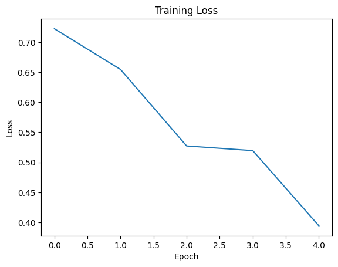
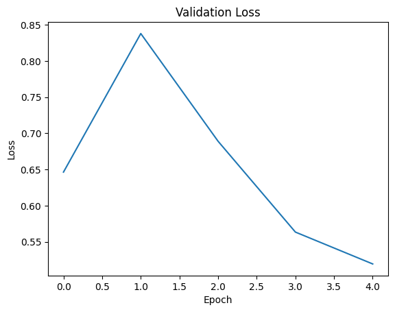
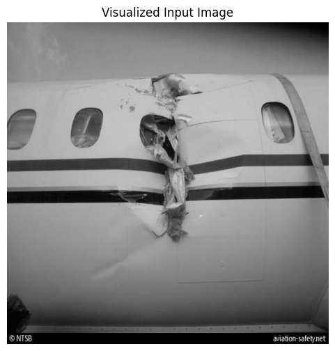
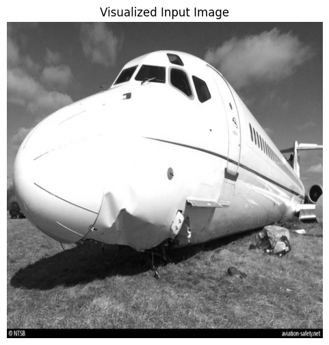
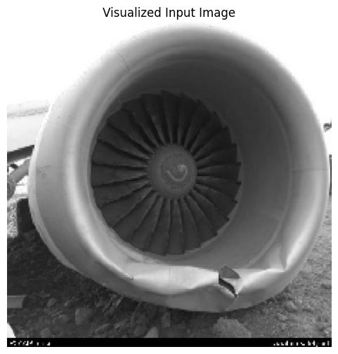
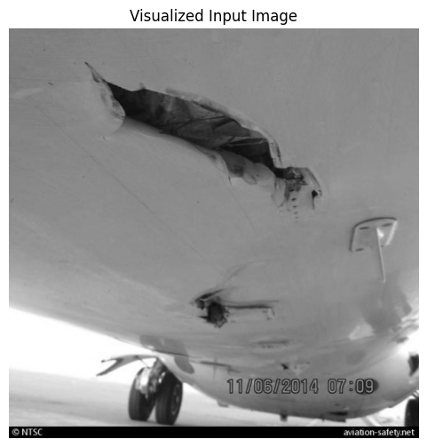
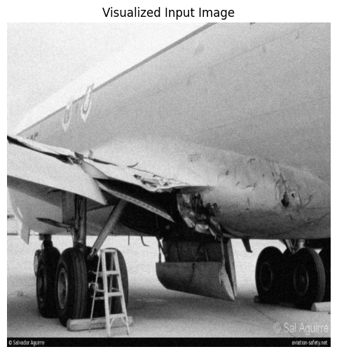

# ✈️ Aircraft Damage Classification and Captioning

This project automates the detection and description of aircraft damage using deep learning. It combines CNN-based image classification with Transformer-based image captioning — enabling AI to not only detect cracks and dents in aircraft but also describe them like a human technician.

---

## 📌 Objectives

- 🔍 **Classify** aircraft images as `crack` or `dent` using VGG16
- 📝 **Generate descriptive captions and summaries** of the image using the BLIP Transformer
- 🤖 Demonstrate a multi-modal deep learning pipeline for real-world aviation damage inspection

---

## 📁 Dataset

- ✅ Real aircraft damage images
- ✅ Labels: `crack` or `dent`
- ✅ Total images: ~450
- ✅ Splits: Train (300), Validation (96), Test (50)
- ✅ Loaded using `ImageDataGenerator`

---

## 🧠 Model Architectures

### 🔧 Classification – VGG16 (Transfer Learning)
- Pretrained on ImageNet
- Custom dense head: `Dense(512) → Dropout → Dense(512) → Dropout → Dense(1)`
- Final activation: `sigmoid`

### ✍️ Captioning – BLIP Transformer
- Pretrained [Salesforce/BLIP](https://huggingface.co/Salesforce/blip-image-captioning-base)
- Used to generate:
  - 📷 **Caption**: General description of the aircraft
  - 📝 **Summary**: Focused summary on the damage type and location

---

## 📊 Results

### ✅ Classification Performance
- **Test Accuracy**: 84.38%
- Visuals: Accuracy & loss plots

        

### ✍️ Sample Captioning Outputs

| No | Caption | Summary |
|----|---------|---------|
| 1   | this is a picture of a plane that was damaged | this is a detailed photo showing the damage of the aircraft |
| 2   | this is a picture of a plane that was sitting on the ground in a field | this is a detailed photo showing the damage to the fuselage of the aircraft |
| 3  | this is a picture of a jet engine | this is a detailed photo showing the turbine of a boeing 747 |
| 4  | this is a picture of a plane that was damaged | this is a detailed photo showing the damage on the fuselage of a b 52 stratner |
| 5  | this is a picture of a plane that has been damaged | this is a detailed photo showing the damage on the wing of the aircraft |

---

## 🧾 Final Summary & Learnings

- ✅ Combined CNN and Transformer models in a single pipeline
- ✅ Used pretrained models (VGG16, BLIP) effectively
- ✅ Learned how to generate captions without reference data
- ✅ Gained experience with model integration, evaluation, and formatting results

---

## 🚀 Future Work

- 📦 Add BLEU/METEOR scoring (if reference captions become available)
- 🔄 Fine-tune BLIP for domain-specific damage language
- 🌐 Deploy as a web app using Streamlit or Gradio
- 🛩️ Extend to multiclass classification (crack, dent, burn, etc.)

---

## 🛠️ Tech Stack

- Python
- TensorFlow / Keras
- HuggingFace Transformers
- Matplotlib, Seaborn
- BLIP, VGG16, PIL

---

## 👨‍💻 Author

**Rishabh Yadav**  
📧 riishabh12@gmail.com 
🔗 [LinkedIn](https://www.linkedin.com/in/rishabh-yadav-7112a935b/)  

